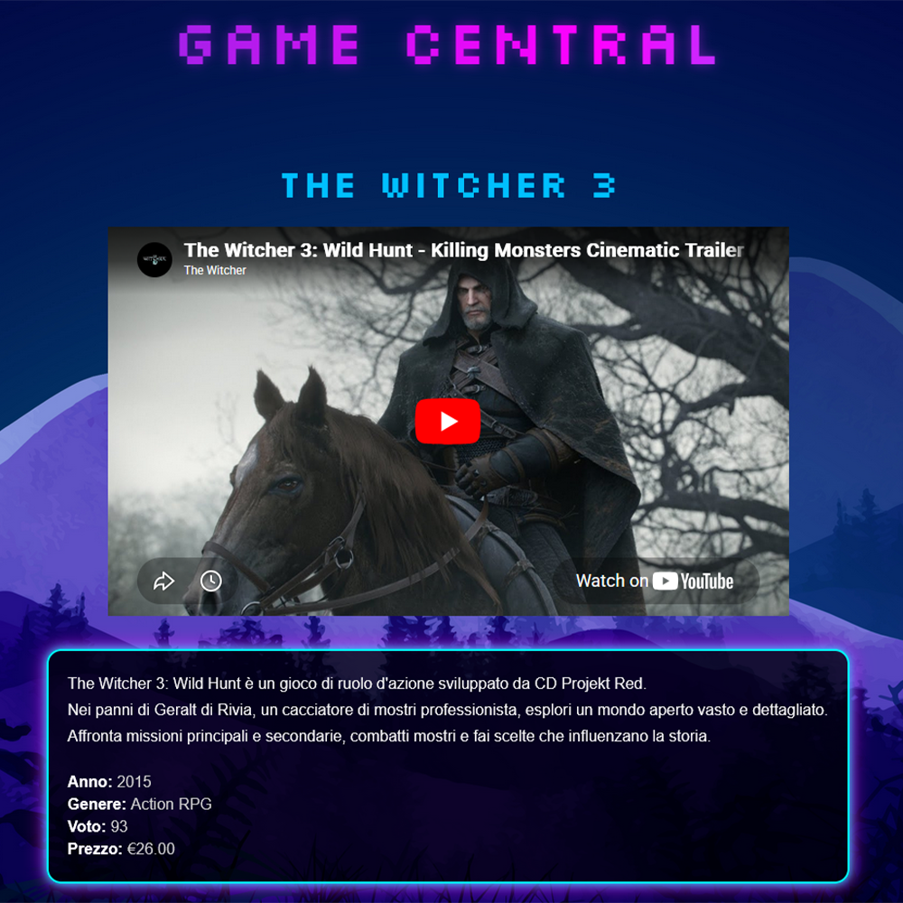

# Game Central overview

Game Central is a Flask + MySQL web application that displays a collection of videogames
with detailed information, images, and embedded trailers.

------------------------------------------------------------

# Used technologies

- Python
- Flask
- MySQL
- HTML5
- CSS3
- Jinja2 Templates

------------------------------------------------------------

# What this project demonstrates

This project demonstrates:
- MySQL database integration with Python
- SQL querying and data retrieval
- Dynamic backend routing using Flask
- Server-side rendering with Jinja2
- Data enrichment using Python dictionaries
- Frontend and backend integration
- Responsive UI design

------------------------------------------------------------

# Project capabilities

The application can:

- Retrieve videogame data from a MySQL database
- Display games dynamically in a responsive grid layout
- Open dedicated detail pages for each game
- Show game metadata such as:
  - release year
  - genre
  - rating
  - price
- Display cover images
- Embed YouTube gameplay/trailer videos
- Render custom game descriptions

------------------------------------------------------------

# Screenshots

## Main page


## Detail page



------------------------------------------------------------

# How to run the project

Install dependencies:

```bash
pip install -r requirements.txt
```

Start the Flask server:

```bash
python main.py
```

Open in browser:

```text
http://localhost:5000
```